# Microsoft 365 + Intune — Cloud Messaging and Mobile Device Management Lab

**A hands-on infrastructure project by Olumide Akomolafe**
*Network Support Technician — Conestoga College (Cambridge, Ontario)*

In this lab I administered a real **Microsoft 365 tenant** end-to-end — user and shared-mailbox provisioning in **Exchange Online**, identity and license management in **Entra ID (Azure AD)**, mail-flow rules, retention policies, MFA enforcement, service-health monitoring, license troubleshooting — **and** the mobile side: an **Intune** deployment for managing iOS sales-team devices with Wi-Fi profile, device restriction, jailbreak detection, and an App Protection Policy enforcing PIN, encryption, and copy-paste boundaries on the corporate Outlook app.

This is the cloud sequel to my [on-prem-exchange-lab](https://github.com/) project — same problem space, now in M365.

---

## The case scenario I built this against

I treated this as a real engagement for a fictional client I'll call **Crestline Retail** — a mid-size retailer with a head office, a field sales team that does most of its work on iPhones, and a warehouse operation that needs cheap shift-worker licenses. Their constraints:

- They want **messaging in the cloud** for redundancy reasons — no more on-prem Exchange to patch on weekends.
- They need a **shared sales mailbox** so customers see one consistent address regardless of who answers.
- Their legal team requires **7-year retention** on all corporate email and **MFA enforced** on every account.
- Their **iPhone sales team** can install Outlook on their personal devices, but corporate data must be **wiped without wiping the user's personal photos** if a phone is lost.
- They want **shift-worker licenses** for warehouse staff — cheapest option that still gives mobile Outlook and Teams.

My deliverable was a configured M365 tenant plus an Intune deployment that meets all of that. Below is the build, captured live with the screenshots from each step.

---

## The tenant I built

| Service | Purpose |
|---|---|
| **Entra ID (Azure AD)** | Identity — users, MFA, conditional access |
| **Exchange Online** | Cloud mailboxes, shared mailbox, mail-flow rules, retention |
| **Microsoft 365 Admin Center** | License assignment, service health, billing controls |
| **Microsoft Intune** | iOS device management, app protection, Wi-Fi profiles |

---

## Chapter 1 — Tenant foundation: billing, licensing, device group

The first thing I did in the new trial tenant — before any service work — was **disable recurring billing** so the trial doesn't silently auto-renew at full retail. This is the line I want my "I have a trial tenant" labs to keep visible: cost control is the first deliverable, not the last.

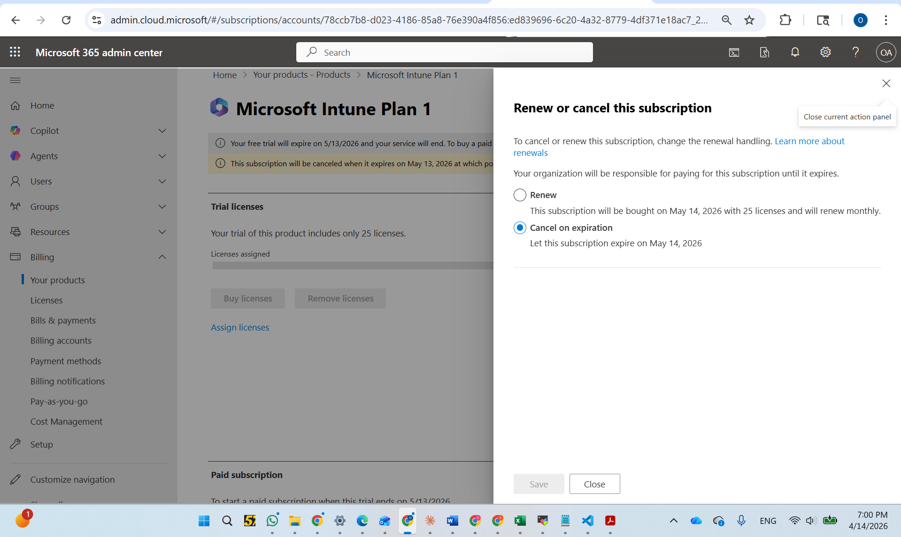
*Auto-renewal turned off on the M365 trial.*

I then assigned the **Intune license** to my admin account (Intune is a separate license from M365's core SKUs; without it the device-management blade is read-only), and created an Entra ID **device group** scoped to this lab so my Intune policies target only the right devices rather than the whole tenant.

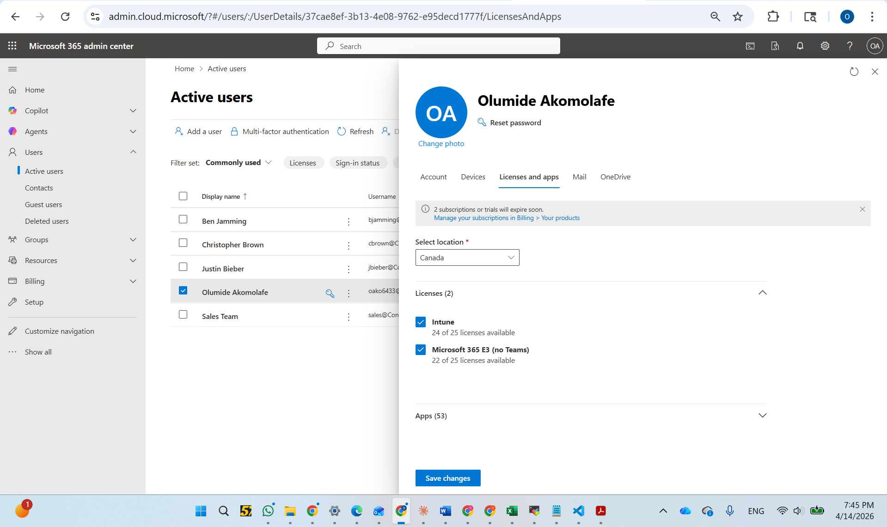
*The Intune Plan 1 license attached to my administrative account.*

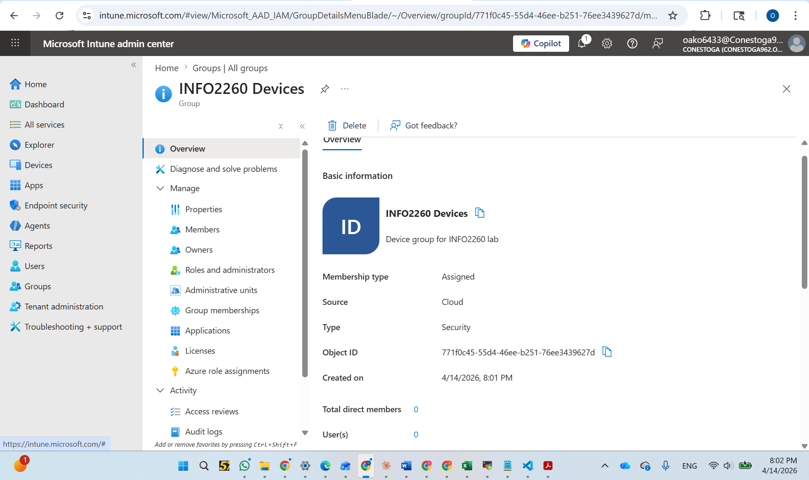
*The device group scoped to this lab — policies will assign to this group, not All Devices.*

**Why a scoped device group, not All Devices.** Targeting "All Devices" in Intune is the most common cause of "the policy fired on the wrong phone" tickets. Always scope to a security group, even in a trial — it forces you to think about who gets the policy before you publish it.

---

## Chapter 2 — Intune device policies

Three device-side policies, each solving a real Crestline problem:

**Wi-Fi Profile Policy** — pushes the corporate Wi-Fi SSID and credentials to every enrolled device, so a new salesperson's iPhone connects without anyone reading the password off a sticky note.

**iOS Device Restriction Policies** — disables app store auto-install of risky apps, blocks the camera in restricted areas, requires a passcode of at least 6 digits. These are the device-OS-level controls Crestline's compliance team asked for.

**Jailbreak Detection Policy** — Intune flags devices showing signs of jailbreak (Cydia present, sandbox escape detected) and marks them non-compliant. Conditional Access then refuses them access to corporate mail. The phone still works as a personal device; it just can't see corporate data.

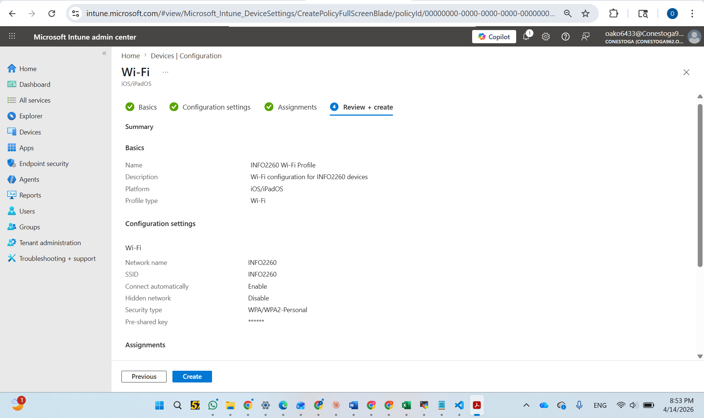
*The Wi-Fi profile policy with SSID, security type, and credential delivery.*

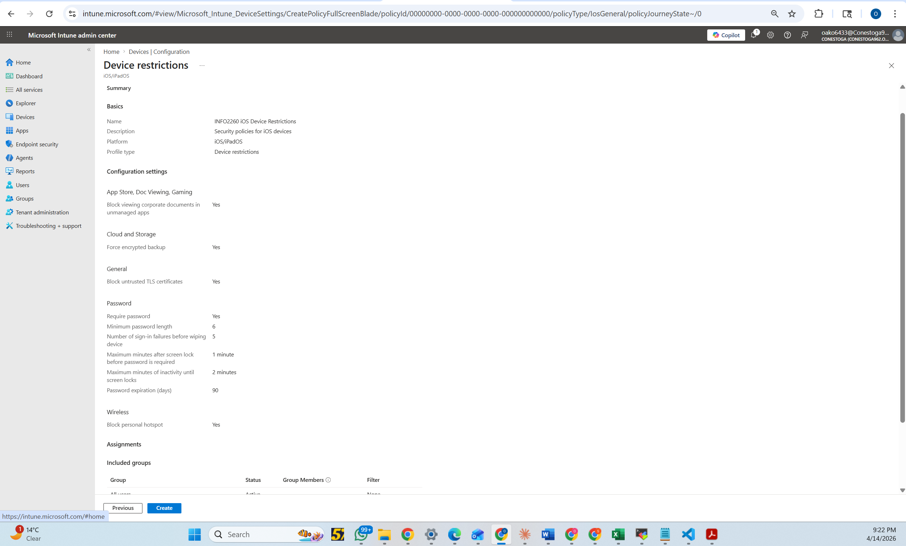
*The iOS device restriction policy — passcode requirements, camera, app store.*

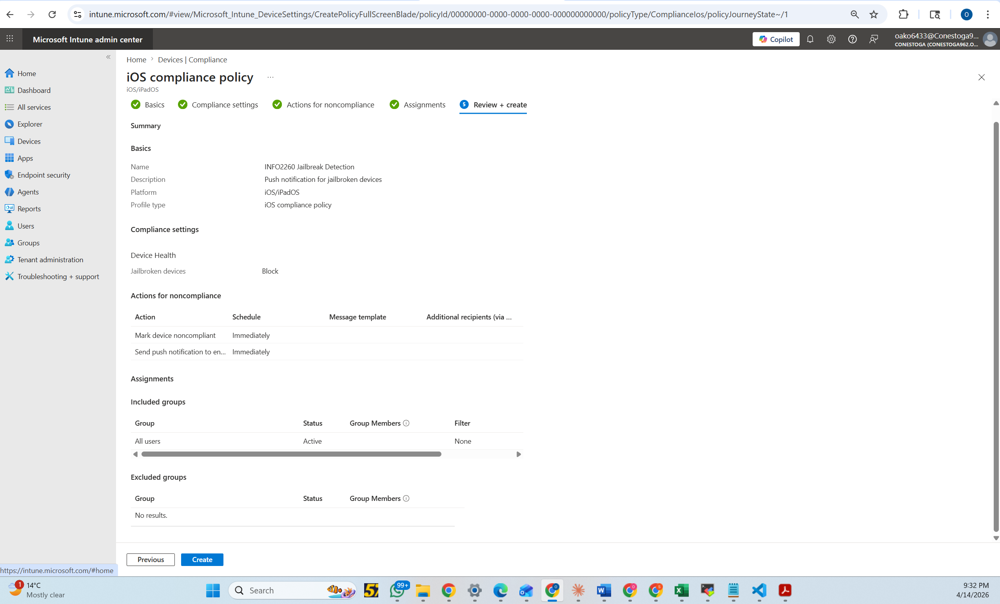
*The compliance policy flagging jailbroken devices as non-compliant.*

**The compliance pattern that matters.** Jailbreak detection on its own does nothing — Intune just *labels* the device. The enforcement comes from a **Conditional Access policy** that says "if device is non-compliant, block access to Exchange Online." Compliance + Conditional Access is the two-part recipe; either one alone is theatre.

---

## Chapter 3 — App protection: the Outlook policy

Crestline's most-asked-for control: salespeople need Outlook on personal phones, but corporate email can't end up in the iOS Files app or in a personal screenshot uploaded to Instagram.

I deployed three Outlook policies that work together:

**Install Outlook iOS App Policy** — pushes the Outlook app to managed devices so a salesperson doesn't have to know where to find it in the App Store.

**App Protection Policy for Outlook** — the central control. Requires a PIN to open Outlook (separate from the device passcode), enforces encryption of cached mail at rest, **blocks copy/paste from Outlook into non-managed apps**, blocks data backup to iCloud, and allows IT to **selectively wipe corporate data** from Outlook without touching personal photos, contacts, or other apps.

**App Configuration Policy for Outlook** — pre-populates the user's mailbox identity, mail signature, and default account, so a salesperson's first launch is already signed in to corporate — no manual setup, no help-desk ticket.

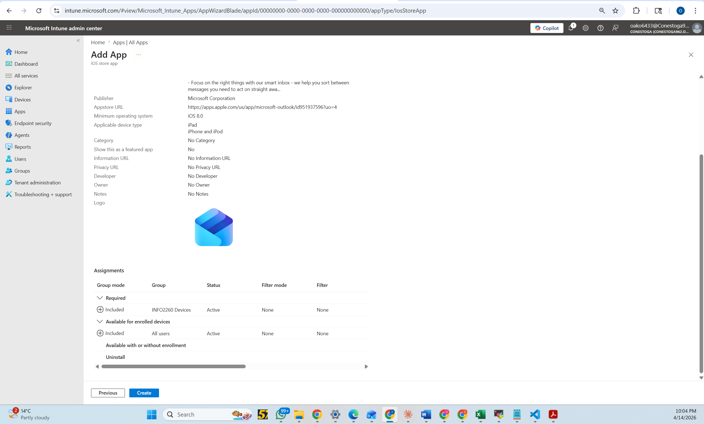
*The deployment policy pushing the Outlook iOS app to enrolled devices.*

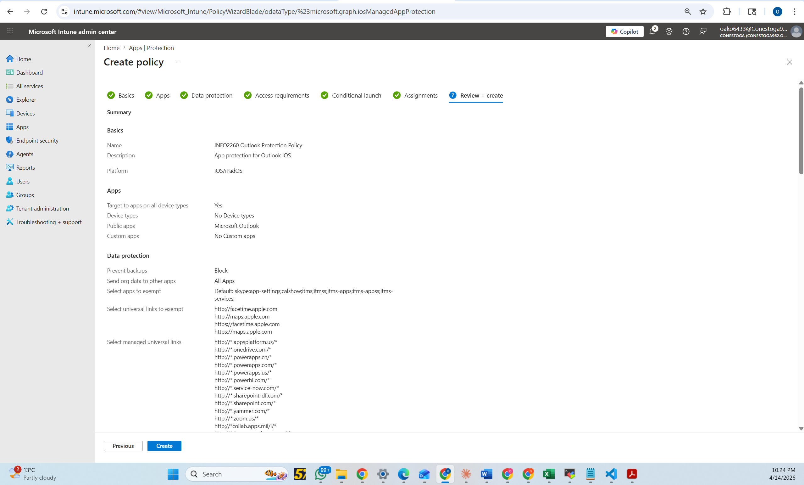
*Data-relocation controls — copy/paste, backup, screenshots restricted.*

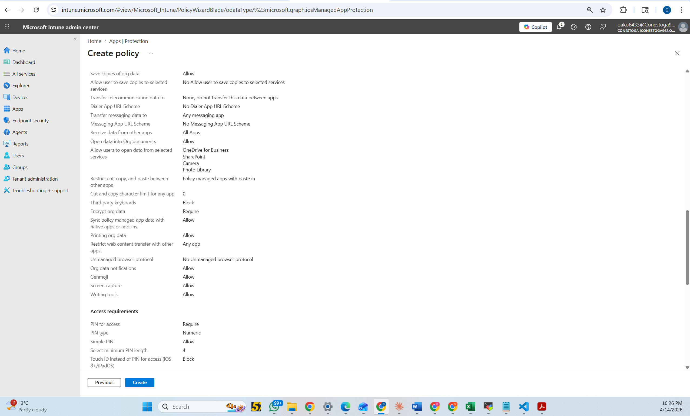
*Access controls — PIN required, biometric allowed as a shortcut.*

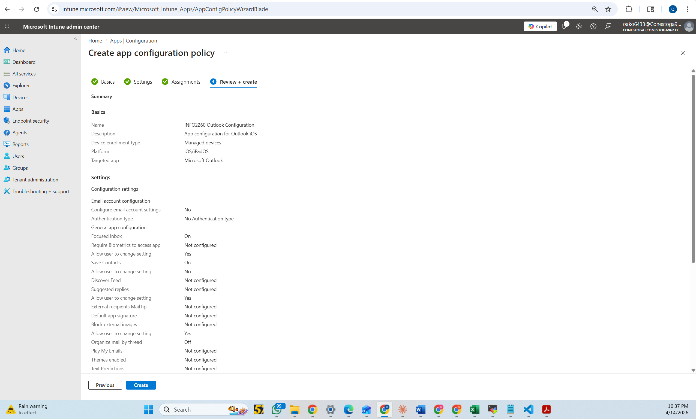
*App configuration pre-populating account settings on first launch.*

**The selective-wipe rule that sells the policy to users.** When a phone is lost, the helpdesk runs a **selective wipe** — Outlook's corporate mailbox and cache are scrubbed from the device, while the user's personal photos, contacts, music, and other apps are untouched. That distinction is the one Intune talking point that wins over a sales team that resents corporate MDM. Frame it as "we protect what's ours and don't touch what's yours" and adoption stops being a fight.

---

## Chapter 4 — Exchange Online, Entra ID, and M365 admin

This is the cloud-administration block — eight tasks against a live tenant.

### Task 1 — User management
Created two cloud-only users — Christopher Brown and Justin Bieber — directly in **Entra ID** with M365 E3 licenses. Renamed Chris from "Chris Brown" to "Christopher Brown" after a first-day correction and added his phone number, demonstrating the inline-edit flow.

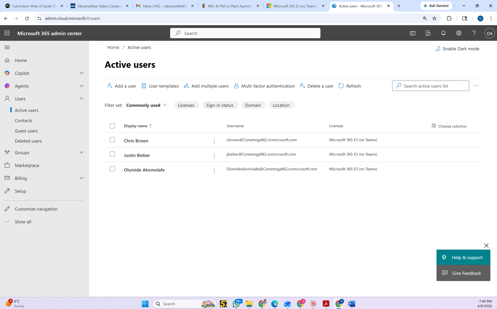
*Christopher Brown and Justin Bieber provisioned in the Microsoft 365 admin center.*

### Task 2 — Shared mailbox with Send-on-Behalf
Created `sales@Conestoga962.onmicrosoft.com` as a **shared mailbox**, granted Christopher Brown and Justin Bieber **Send-on-Behalf** permission, so customer-facing mail goes out from `sales@` regardless of who answered, with audit transparency for who actually sent it.

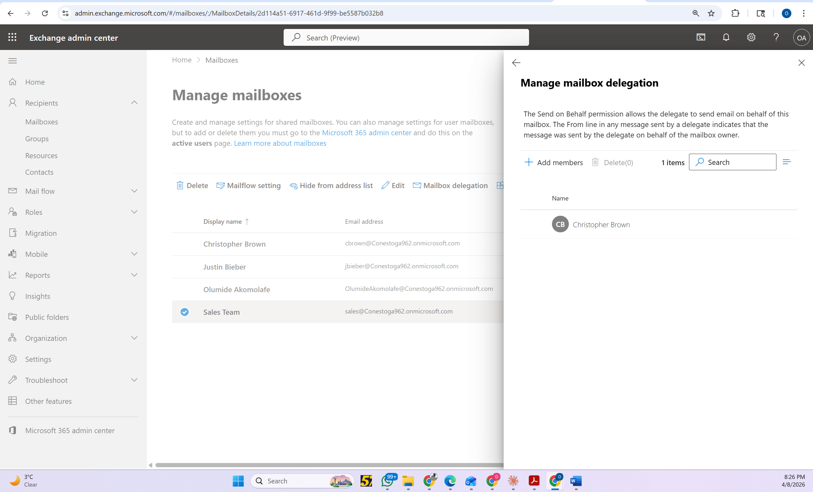
*The shared mailbox with Christopher Brown granted Send-on-Behalf.*

### Task 3 — Mail-flow disclaimer rule
Built an **Exchange Online mail-flow rule** that appends the corporate disclaimer to every outbound email leaving the tenant. Verified end-to-end by sending a test message and confirming the disclaimer landed on the recipient side.

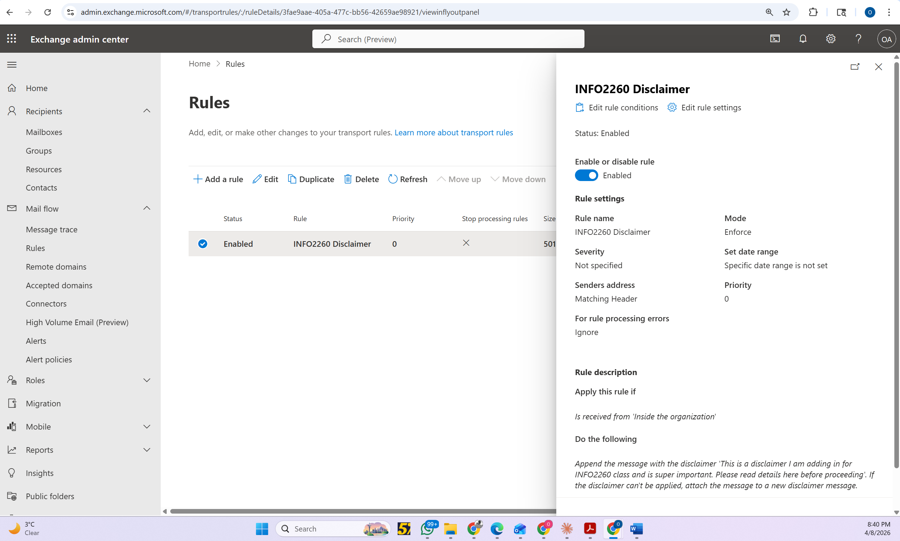
*The mail-flow rule appending a corporate disclaimer on outbound mail.*

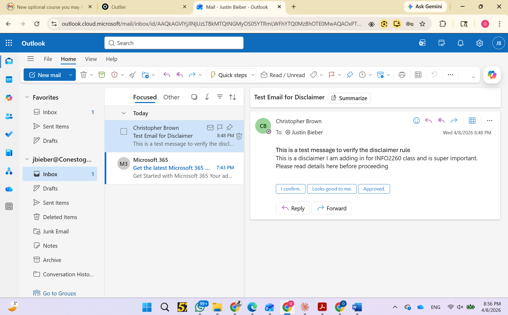
*The test email arriving with the disclaimer correctly appended.*

### Task 4 — Security and compliance
- **7-year retention policy** applied to all Exchange Online mailboxes — meets the legal hold requirement.
- **MFA enabled** on Justin Bieber's account — confirmed via the Entra ID per-user MFA dashboard.
- **Conditional Access policy** documented for the broader rollout.

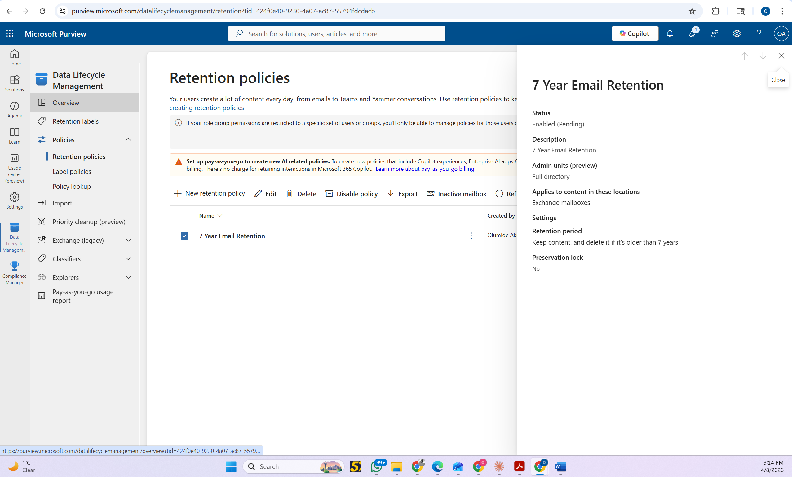
*The Exchange Online retention policy with a seven-year hold.*

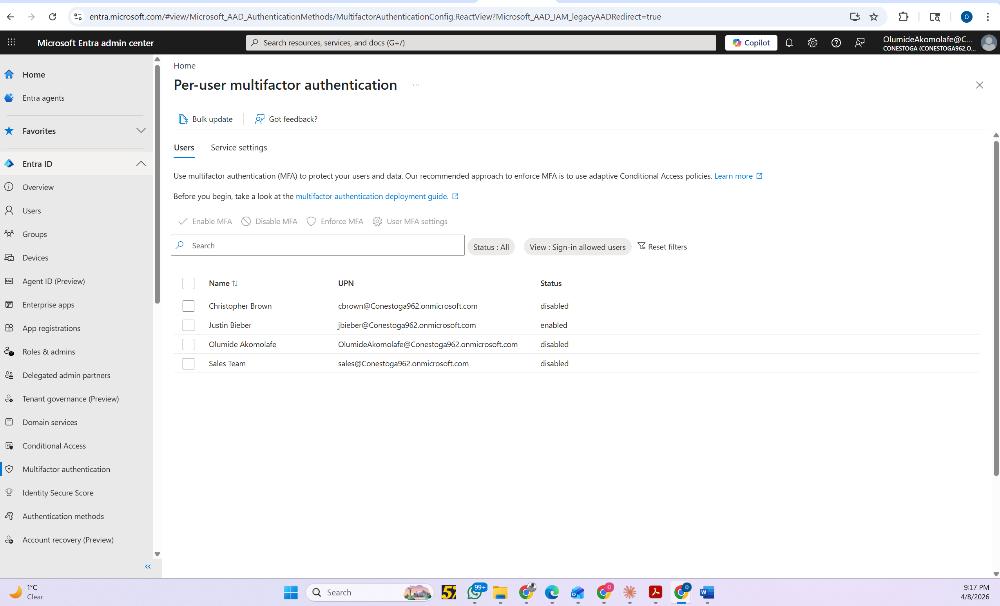
*Justin Bieber's MFA status flipped to Enabled.*

### Task 5 — Service health monitoring
Pulled the **Exchange Online service-health dashboard** during an active service incident (a service-degradation event affecting archived email access in the region). This is what Tier-2 looks at first when a "my email is slow" ticket comes in — before assuming it's the user's device.

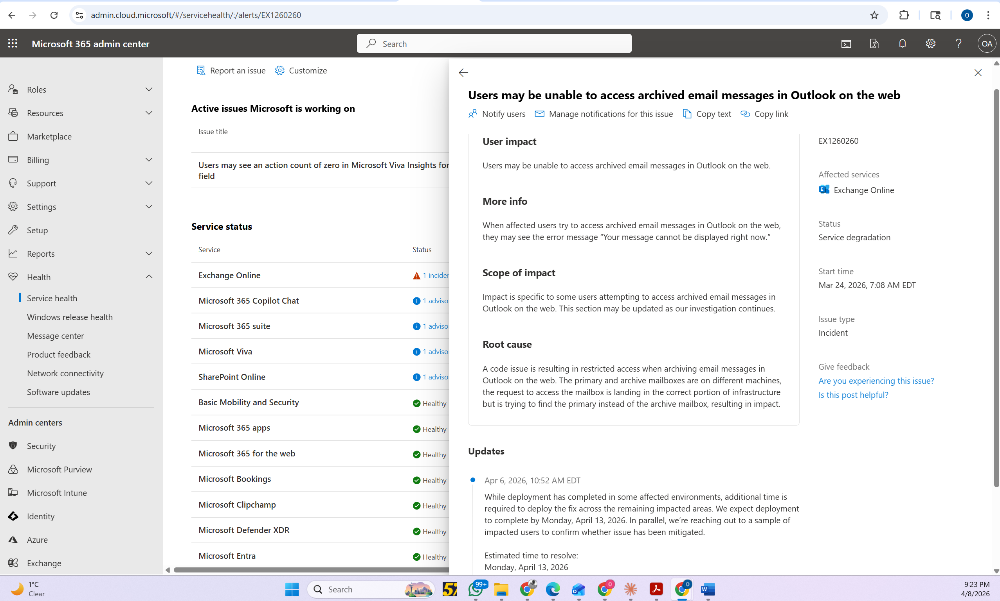
*The Microsoft 365 service-health page showing a live incident.*

### Task 6 — License troubleshooting
A real ticket: **Ben Jamming reports he can't send email.** Triage:

1. Check his Entra ID account — exists, active.
2. Check his licenses — has an M365 E3 SKU.
3. Check the SKU's component status — `EXCHANGE_S_ENTERPRISE` shows **Off**.

Root cause: the Exchange Online sub-component of the SKU was toggled off when the bulk license was assigned. The fix was to flip it back on; the user's mailbox provisioned within five minutes.

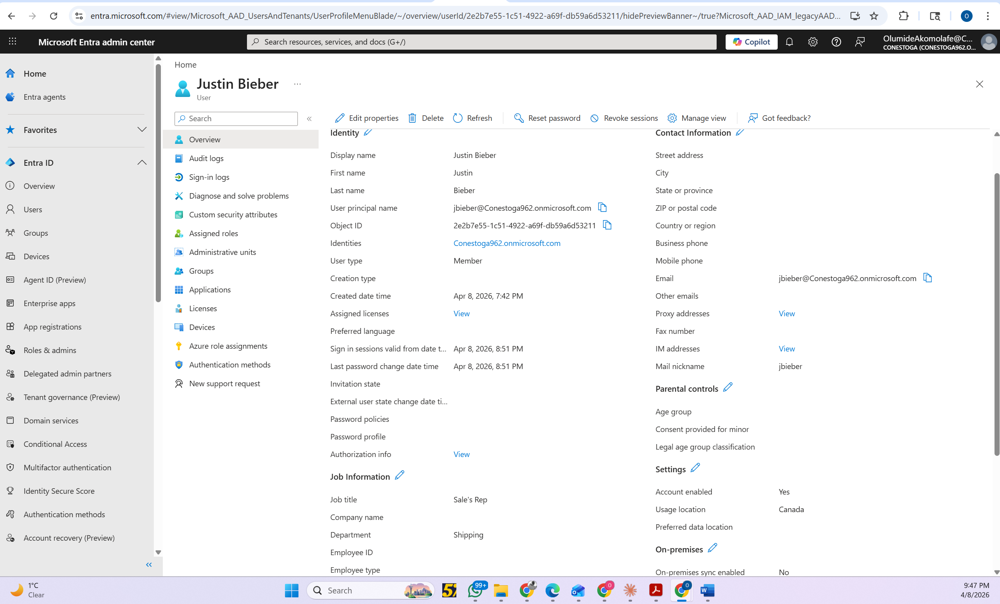
*Justin Bieber moved into the Shipping department as part of the same admin block.*

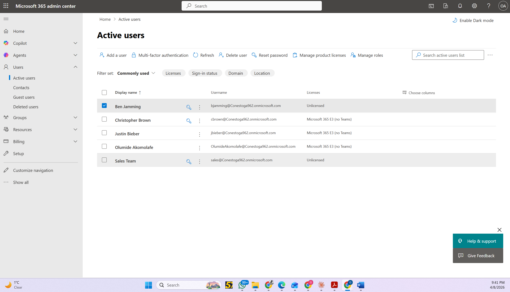
*Ben's user object visible in Entra ID but the Exchange Online sub-license is disabled.*

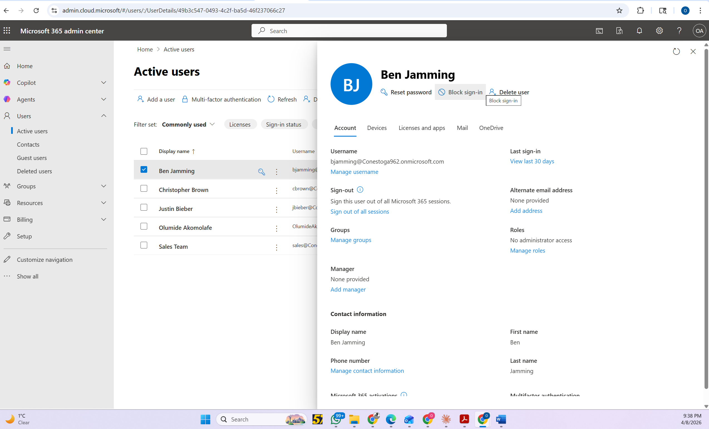
*Flipping the Exchange Online sub-license back on.*

**The license-troubleshooting reasoning.** When a user "can't send email" but their account is healthy and they have a license assigned, the next check is always the sub-licenses (also called "service plans"). M365 E3 is a bundle of about 30 service plans, and any of them can be toggled off individually. A user-management bulk action that disables Stream or Sway looks fine until you accidentally also untick Exchange Online — and then "the licensed user has no mailbox" is the symptom.

### Task 7 — License selection for warehouse shift workers
For Crestline's warehouse staff I recommended **Microsoft 365 F3** (frontline-worker SKU) at $8/user/month. Justification: it includes web and mobile versions of Word/Excel/Outlook, Teams, Yammer, and SharePoint, which is exactly what shift workers on shared kiosks need. It does not include desktop Office, which they don't need either. It's the lowest-cost license that satisfies the requirement set.

I documented the comparison against M365 E3 ($36/user) and Business Standard ($12.50/user) in the assignment write-up.

### Task 8 — Auto-renewal de-activation
Closed the engagement by re-confirming the trial tenant's auto-renewal is disabled.

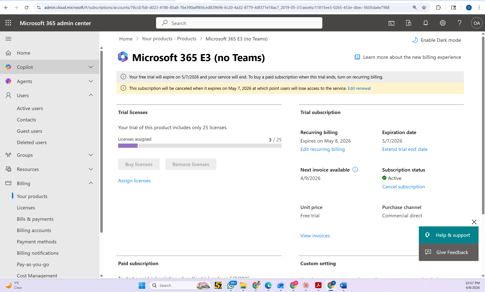
*Final state — recurring billing remains disabled, the trial expires gracefully.*

---

## Skills I'm demonstrating in this repo

**Intune mobile device management** — license assignment, scoped device groups, Wi-Fi profile push, iOS device restrictions, jailbreak detection paired with Conditional Access, App Protection Policies (PIN, encryption, copy-paste boundary, selective wipe), App Configuration Policy for first-launch setup.

**Exchange Online administration** — cloud mailbox provisioning, shared mailbox with Send-on-Behalf delegation, mail-flow rule for disclaimer append, 7-year retention policy.

**Entra ID (Azure AD)** — user provisioning, license assignment with sub-component awareness, MFA enable per user, Conditional Access conceptual model.

**Microsoft 365 admin operations** — service-health monitoring (incident-aware triage), license troubleshooting via sub-component analysis, cost-aware license selection across F3 / Business Standard / E3.

**Trial-tenant hygiene** — recurring billing disabled at tenant creation, verified again at engagement close.

---

## What's in this repo

```
m365-intune-lab/
├── README.md
├── .gitignore
└── screenshots/
    ├── 01-tenant-and-licensing/        ( 3 captures — billing, license, device group)
    ├── 02-device-policies/             ( 3 captures — Wi-Fi, iOS restrictions, jailbreak detection)
    ├── 03-app-policies/                ( 6 captures — Outlook install, App Protection, App Configuration)
    └── 04-exchange-online-admin/       (13 captures — users, shared mailbox, mail-flow, retention, MFA, license troubleshooting)
```

25 screenshots total, all captured against a live M365 tenant and Intune console.

---

## My companion projects

| Repo | What's in it |
|---|---|
| [**on-prem-exchange-lab**](https://github.com/) | The on-prem prequel to this lab — Exchange Server 2016, AD, distribution groups, dynamic groups, mail-flow rules, PowerShell admin |
| [**windows-ad-infrastructure-lab**](https://github.com/) | The Windows Server 2019 AD lab — domain, DHCP, DNS, file shares with NTFS least-privilege |
| [**web-infrastructure-iis-nginx-sql-lab**](https://github.com/) | IIS on Windows + NGINX on Rocky + SQL Server + Hyper-V with a nested Rocky VM |
| [**qvis-network-portfolio**](https://github.com/) | A complete small-business multi-VLAN network in Cisco Packet Tracer with a four-part video walkthrough |
| [**qvis-aws-portfolio**](https://github.com/) | AWS cloud architecture for the QVIS Quick Vehicle Insurance System (Lagos State MVAA) |

---

## Contact

**Olumide Akomolafe**
Cambridge, Ontario · Network Support Technician
I'm actively looking for Tier-1 and Tier-2 Network Support roles in Ontario.
